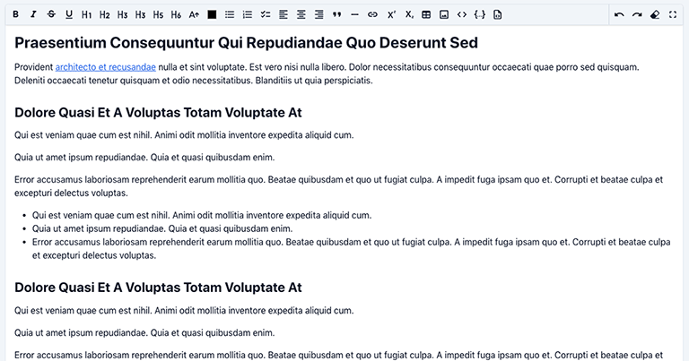
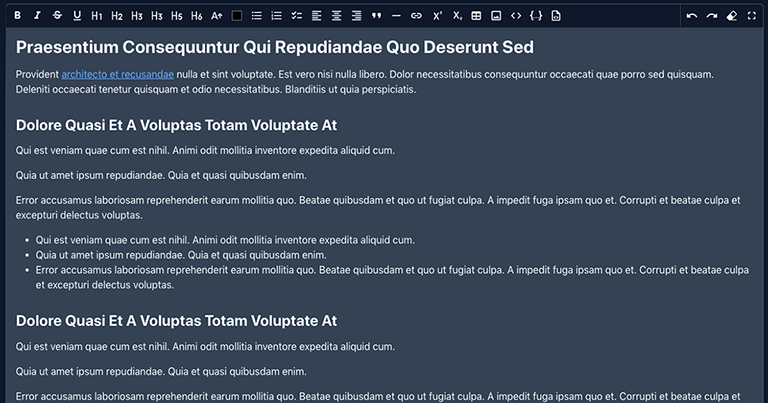
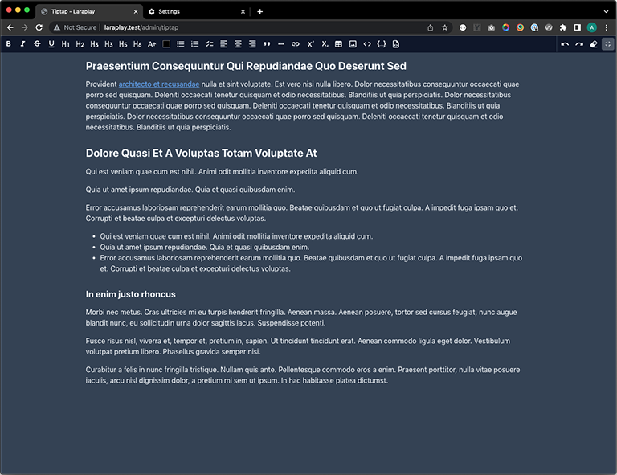

# Filament Tiptap Editor

A Tiptap ingtegration for Filament Admin/Forms.







- Supports Light/Dark Mode
- Fullscreen editing
- Overrideable Media uploading
- Profile based toolbars to simplify reusing features

## Installation

Install the package via composer

```bash
composer require awcodes/filament-tiptap-editor
```

## Usage

The editor extends the default Field class so most other methods available on that class can be used when adding it to a form.

```php
use FilamentTiptapEditor\TiptapEditor;

TiptapEditor::make('content')
    ->profile('default|simple|barebone|custom')
    ->tools([]) //-> individual tools to use in the editor, overwrites profile
    ->required();
```

## Config

Publish the config file.

```bash
php artisan vendor:publish --tag="filament-tiptap-editor-config"
```

### Profiles / Tools

The package comes with 3 profiles for buttons/tools out of the box.

- default: includes all available tools
- simple
- barebone

See `filament-tiptap-editor.php` config file for modifying profiles to add / remove buttons from the editor or to create your own.

Tools can also be added on a per instance basis. Using the `->tools()` modifier will overwrite the profile set for the instance. A full list of tools can be found in the `filament-tiptap-editor.php` config file under the default profile setting.

### Media / Images

- accepted_file_types: ['image/jpeg', 'image/png', 'image/webp', 'image/svg+xml', 'application/pdf']
- disk: 'public'
- directory: 'images'
- visibility: 'public'
- preserve_file_names: false
- max_file_size: 2042
- image_crop_aspect_ratio: null
- image_resize_target_width: null
- image_resize_target_height: null
- media_uploader_id: 'filament-tiptap-editor-media-uploader-modal'

## Overrides

### Link Modal

You may override the default link modal with your own Livewire component and assign its ID to the `link_modal_id` setting in the config file.

See `vendor/awcodes/resources/views/components/link-modal.blade.php` and `vendor/awcodes/filament-tiptap-editor/src/Components/LinkModal.php` for implementation.

### Media Modal

You may override the default file uploader with your own Livewire component and assign its ID to the `media_uploader_id` setting in the config file.

See `vendor/awcodes/resources/views/components/media-uploader-modal.blade.php` and `vendor/awcodes/filament-tiptap-editor/src/Components/MediaUploaderModal.php` for implementation.

### Initial height of editor field

You can add extra input attributes to the field with the `extraInputAttributes()` method. This allows you to do things like set the initial height of the editor.

```php
TiptapEditor::make('barebone')
    ->profile('barebone')
    ->extraInputAttributes(['style' => 'min-height: 12rem;']),
```

## Usage in Standalone Forms Package

1. Publish the JS/CSS assets

```bash
php artisan vendor:publish tag="filament-tiptap-editor-assets"
```

2. Include the CSS files in your page / layout
2. Include the JS files in your page / layout before Filament's scripts
3. Include a `@stack('modals')` in your page / layout if it doesn't exist

## Versioning

This projects follow the [Semantic Versioning](https://semver.org/) guidelines.

## License

Copyright (c) 2022 Adam Weston and contributors

Licensed under the MIT license, see [LICENSE.md](LICENSE.md) for details.
