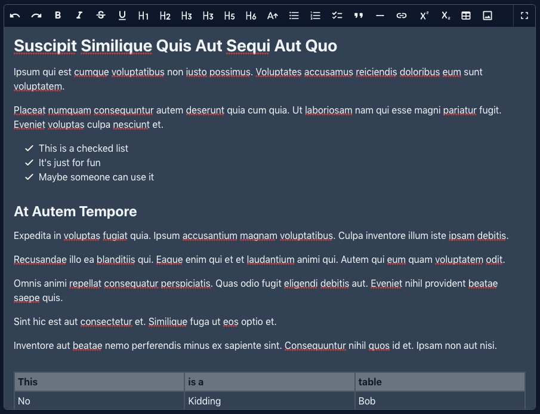

# Filament Tiptap Editor

A Tiptap ingtegration for Filament Admin/Forms.



- Supports Light/Dark Mode
- Fullscreen editing
- Overrideable Media uploading
- Profile based buttons to simplify reusing features
- Includes all Tiptap extensions in the Starter Kit and Tables. More extensions to come...

## Installation

Install the package via composer

```bash
composer require awcodes/filament-tiptap-editor
```

Optionally, Publish config files and assets.

The package comes with 3 profiles for buttons out of the box. Unless you need to create your own profiles there is no need to publish.

```bash
php artisan vendor:publish --tag="filament-tiptap-editor-config"
```

## Usage

The editor extends the default Forms Field class so all other methods available on that class can be used when adding it to a form.

```php
use FilamentTiptapEditor\TiptapEditor;

TiptapEditor::make('content')
    ->profile('simple')
    ->required(); //->etc
```

See `filament-tiptap-editor.php` config file for modifying profiles to add / remove buttons from the editor.

You may also override the default file upload with your own Livewire component and assigning its ID to the `media_upload_id` setting in the config file.

## Versioning

This projects follow the [Semantic Versioning](https://semver.org/) guidelines.

## License

Copyright (c) 2022 Adam Weston and contributors

Licensed under the MIT license, see [LICENSE.md](LICENSE.md) for details.
